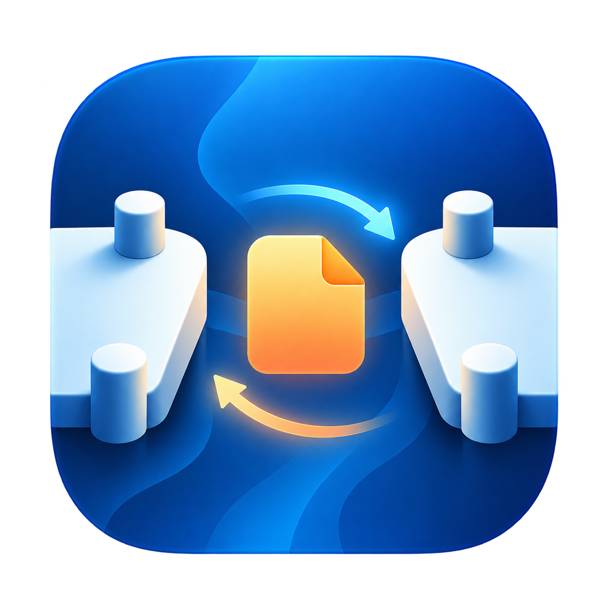

<p align="center">
  
</p>

# PeerJetty

**A familiar destination for files between your Macs.**

Pair your work devices, choose a default destination, then drag files into a card near the top of the screen. PeerJetty sends directly over your local network, with automatic receiving from paired devices and a receiving folder you choose.

**English** · [简体中文](README.zh-CN.md)

[Releases](https://github.com/TimeLyr1c/PeerJetty/releases/latest) · [User guide](Docs/TUTORIAL.md) · [Roadmap](Docs/ROADMAP.md)

## Why PeerJetty?

PeerJetty is for people who regularly switch between a laptop and a desktop Mac. A remembered destination, a quick drag target and predictable receiving make repeated handoffs easier. It works with or without a display notch.

AirDrop is a good option for occasional nearby sharing; LocalSend and similar tools serve broader, cross-platform workflows. PeerJetty focuses on paired Mac workspaces. There are no claims of superior speed or independently audited security.

## What it does

- **Pair once:** discover devices on the LAN and compare a six-digit code on both screens.
- **Send both ways:** send files and folders with drag and drop or a file picker. Sending and receiving can overlap.
- **Receive predictably:** paired devices receive automatically; choose the folder and optionally open fully received files. Auto-open is off by default.
- **Protect the transfer:** direct TLS 1.3, file integrity checks and collision-safe saving without overwriting existing files.
- **Stay native:** Swift and AppKit, English and Simplified Chinese, with an in-app language choice.

### Current release: 1.0.0

Includes plain-text transfer and local history, five-page settings, independent Dock/menu icons, startup reconnection, and explicit connection and disk-space feedback. See the [user guide](Docs/TUTORIAL.md).

## Install and start

Requires **Apple Silicon (M-series), macOS 15 or later** for the distributed installer. Intel builds are not currently verified or distributed.

1. Download the DMG from **Assets** on the [latest release](https://github.com/TimeLyr1c/PeerJetty/releases/latest).
2. Open it, drag `PeerJetty.app` into **Applications**, and eject the image.
3. Open PeerJetty on both Macs and allow local-network access when requested.
4. Set each Mac's name and receiving folder. Open **Add device** on both, connect to the other Mac, and confirm only matching six-digit codes.
5. Choose your default sending destination. Drag files toward the upper center **below the menu bar**, then drop into the card.

Keep both apps running and both Macs awake on the same LAN. Wait for confirmation that the other Mac has saved the files. Closing Settings does not quit PeerJetty.

Distributed builds currently use ad hoc signing and are **not Apple-notarized**. For first-launch verification messages, check the download source and follow [Apple's guidance](https://support.apple.com/en-us/102445). Detailed installation and troubleshooting steps are in the [guide](Docs/TUTORIAL.md#install).

## Scope and privacy

- Mac-to-Mac, LAN only. No transfer account, cloud relay or SSH. Windows, cross-network transfer, offline delivery and resume are not implemented.
- Files, names, folder structure and basic permissions transfer; Finder tags, ACLs, extended attributes and resource forks do not. This is not a backup or continuous-sync tool. Save files before sending; archive metadata-sensitive content appropriately.
- Successful text sends and receipts are **always recorded locally**. Hiding history does not stop recording. Text is never automatically pasted, executed or opened as a link. See [text privacy](Docs/TEXT.md#history-and-privacy--历史与隐私).
- Configuration lives under `~/Library/Application Support/PeerJetty/`; private device identity lives in the local Keychain. Do not sync device identities, trust/configuration or text history through Git or Dropbox. The local text database is not encrypted by the app.
- Update checking contacts GitHub only when requested; installation is manual. The pairing protocol has not had an independent security audit. See [protocol and limitations](Docs/PROTOCOL.md) and [security reporting](SECURITY.md).

## Build from source

Use a current Xcode or Command Line Tools toolchain with a **macOS 26 or newer SDK** for the native glass APIs; the deployment target remains macOS 15. Python 3 and system OpenSSL are also required. There are no third-party Swift package dependencies or web runtime.

```sh
git clone https://github.com/TimeLyr1c/PeerJetty.git
cd PeerJetty
./build.sh
```

Output: `outputs/PeerJetty.app`. Building does not install or publish it. The script builds for the host architecture, not a universal binary. For source/build/archive organization and tests, see [development workflow](Docs/WORKFLOW.md) and [contributing](CONTRIBUTING.md).

## Help and contribute

For a bug report, include app version/build (About → Diagnostic details), macOS version, reproduction steps and expected/actual behavior. Remove private paths, filenames, identifiers and text from attachments. Use [Issues](https://github.com/TimeLyr1c/PeerJetty/issues) for ordinary bugs and ideas; follow [SECURITY.md](SECURITY.md) for security concerns.

[User guide](Docs/TUTORIAL.md) · [中文教程](Docs/TUTORIAL.zh-CN.md) · [Contribution guide](CONTRIBUTING.md) · [Localization](Docs/LOCALIZATION.md) · [Design rules](Docs/design/DESIGN_SYSTEM.md) · [Changelog](CHANGELOG.md)

## License and origins

[MIT](LICENSE). PeerJetty grew from an OpenOnMini Starter supplied by the founder's roommate. `Original/` preserves that source baseline; `Sources/` contains the current LAN implementation. See [license and source notes](LICENSE-NOTES.md) for attribution and artwork details.
